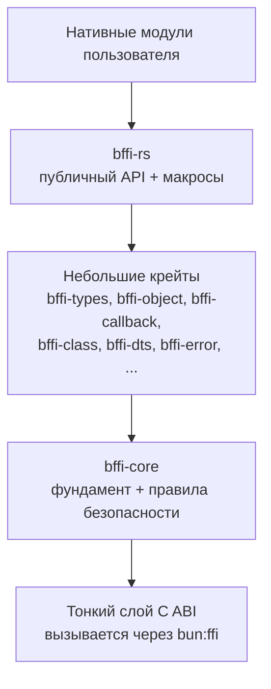

# bffi-rs - Дизайн-документ

[English](https://github.com/DotBlood/bffi-rs/blob/main/docs/DESIGN.md) | **[Русский](https://github.com/DotBlood/bffi-rs/blob/main/docs/i18n/ru/DESIGN.md)** | [简体中文](https://github.com/DotBlood/bffi-rs/blob/main/docs/i18n/zh-CN/DESIGN.md)

**Статус:** Готово  
**Дата:** 2026-09-02  
**Лицензия:** MIT  
**Репозиторий:** https://github.com/DotBlood/bffi-rs  
**Контакт:** contact@z2net.com

---

## 1. Резюме

`bffi-rs` - это фреймворк биндингов для написания нативных Rust-модулей, нацеленных **только на Bun**.

Это Bun-аналог `napi-rs` со следующими отличиями:

- нацелен **только на Bun** (без Node.js / Deno);
- **не** зависит от Node-API;
- использует `bun:ffi` и тонкий слой C ABI;
- строится **снизу вверх** из небольших крейтов.

Цель: удобный, относительно безопасный и идиоматичный способ писать высокопроизводительные нативные расширения для Bun.

---

## 2. Мотивация

Сегодня большинство нативных модулей для Bun пишутся с помощью `napi-rs` (Node-API). Это приводит к:

1. Зависимости от чужого API и модели исполнения.
2. Best-effort совместимости с Node-API в Bun (баги в граничных случаях).
3. Невозможности в полной мере задействовать специфичные для Bun возможности и оптимизации.

Мы хотим слой, нативный для экосистемы Bun, с предсказуемым поведением под Bun.

---

## 3. Цели

- Эргономичные нативные модули Rust → Bun.
- Безопасные абстракции над C ABI (насколько это возможно на практике).
- Поддержка функций, классов, буферов, колбэков, управления временем жизни, ошибок.
- Разработка снизу вверх из небольших, хорошо протестированных крейтов.
- Стабильный тонкий слой C ABI в итоге.
- Генерация TypeScript `.d.ts` с первого дня.
- Полностью открытый исходный код (MIT).

---

## 4. Не-цели

- Совместимость с Node.js или Deno.
- 100% совместимость API с `napi-rs`.
- Максимальная производительность любой ценой с первого дня.
- Скрытие опасных операций (zero-copy и т.п.).

---

## 5. Высокоуровневая архитектура



Порядок разработки: фундамент → по одной возможности за раз → эргономичный API → стабильный C ABI.

---

## 6. Модель безопасности

Переход через C ABI отбрасывает почти все гарантии безопасности Rust. Правила:

### 6.1 Граница FFI
- Каждая функция `extern "C"` должна быть максимально тонкой.
- Немедленно оборачивать тело в `catch_unwind`.
- Паники никогда не должны пересекать границу FFI в production-сборках.

### 6.2 Владение через хендлы
Мы используем **Generational Index + type-tag**:

```rust
// u64 = (type_tag << 48) | (generation << 24) | index
type Handle = u64;
```

Внутри Rust мы храним `Arc<T>` (или эквивалент) в таблице.  
Снаружи виден только непрозрачный (opaque) хендл.

### 6.3 Буферы и строки
- По умолчанию = **копирование**.
- Zero-copy разрешён только через `bffi::unsafe_zero_copy`.
- Опасные API должны быть очевидными.

### 6.4 Колбэки
- Явная регистрация.
- Не должны быть вызываемыми после уничтожения.
- Вызовы из чужого потока либо отклоняются, либо безопасно маршалируются.

### 6.5 Паники
- **Dev** - может прерываться (лучше отладка).
- **Prod** - всегда преобразуется в JS `Error`.

---

## 7. Принятые решения

| Тема                   | Решение                                                   |
|------------------------|-----------------------------------------------------------|
| Макрос                 | `#[bffi]`                                                 |
| Минимальная версия Bun | 1.4.0                                                     |
| Rust / Cargo           | 1.98.0                                                    |
| Хендлы                 | Generational Index + type-tag                             |
| Формат ошибок          | `BffiError` = код + сообщение + источник; доменные ошибки конвертируются без потерь через `From` |
| Владение объектами | `ObjectWrap<T>` поверх глобального `Registry`; один тег = один тип на процесс (диапазон 0x0100-0x01FF); release освобождает слот, держатели `Arc` сохраняют значение |
| Кодировка строк на границе | UTF-8 каноническая (`bun:ffi cstring`)                   |
| Конкурентность таблиц  | Lock-free; reclamation через hazard-указатели; закреплённые двухуровневые страницы ячеек |
| UTF-8 валидация        | SIMD (x86 SSSE3, aarch64 NEON); скалярный DFA - эталонная семантика |
| Буферы                 | Копирование по умолчанию                                  |
| Zero-copy              | Только через `bffi::unsafe_zero_copy`                     |
| Event loop             | Старт с `run()`; `pump()` пока заглушка                   |
| TypeScript-типы        | Генерация с первого дня (`bffi-dts`)                      |
| Паника (prod)          | Преобразуется в JS Error                                  |
| Паника (dev)           | Может прерываться (abort)                                 |
| Совместимость          | Только Bun                                                |
| Дистрибуция            | Исходники в репозитории; prebuilt-бинарники позже для npm |
| Лицензия               | MIT                                                       |

---

## 8. Компоненты

| Крейт             | Назначение                                                    | Приоритет |
|-------------------|---------------------------------------------------------------|-----------|
| `bffi-core`       | Хендлы, catch_unwind, базовые утилиты, правила безопасности   | P0        |
| `bffi-types`      | Преобразование типов (числа, строки, буферы, …)               | P0        |
| `bffi-error`      | Единое преобразование ошибок → JS Error                       | P0        |
| `bffi-object`     | Владение объектами / ObjectWrap                               | P1        |
| `bffi-callback`   | Безопасные колбэки (в обоих направлениях)                     | P1        |
| `bffi-dts`        | Генерация TypeScript `.d.ts`                                  | P1        |
| `bffi-macros`     | Процедурные макросы (`#[bffi]`, атрибуты)                     | P1        |
| `bffi-class`      | Макросы объявления классов                                    | P2        |
| `bffi-event-loop` | Абстракция `run()` / `pump()`                                 | P2        |
| `bffi-build`      | Помощники сборки, генерация C ABI, интеграция с Bun           | P2        |
| `bffi-rs`         | Публичный фасад, реэкспортирующий стек                        | P2        |
| `bffi-async`      | Поддержка Promise / async                                     | P3        |

---

## 9. Принципы проектирования API

1. Явное лучше магического.
2. Безопасно по умолчанию; опасные пути явные.
3. Небольшие крейты, у каждого одна ответственность.
4. Документируйте контракты владения на каждой границе FFI.
5. Bun-first - без компромиссов ради других рантаймов.

---

## 10. Контакт

- GitHub Issues / Discussions  
- Email: **contact@z2net.com**
