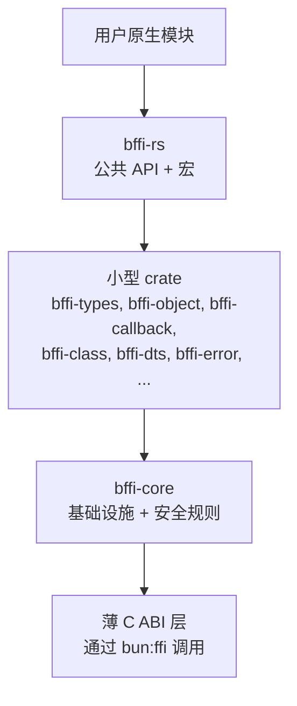

# bffi-rs - 设计文档

[English](https://github.com/DotBlood/bffi-rs/blob/main/docs/DESIGN.md) | [Русский](https://github.com/DotBlood/bffi-rs/blob/main/docs/i18n/ru/DESIGN.md) | **[简体中文](https://github.com/DotBlood/bffi-rs/blob/main/docs/i18n/zh-CN/DESIGN.md)**

**状态:** Done  
**日期:** 2026-09-02  
**许可证:** MIT  
**仓库:** https://github.com/DotBlood/bffi-rs  
**联系方式:** contact@z2net.com

---

## 1. 概述

`bffi-rs` 是一个用于编写 Rust 模块的原生绑定框架,仅面向 **Bun**。

它是 `napi-rs` 在 Bun 上的对应物,区别如下:

- 仅面向 **Bun**(无 Node.js / Deno);
- **不**依赖 Node-API;
- 使用 `bun:ffi` 和一层薄的 C ABI 层;
- 自**底向上**由小型 crate 构建而成。

目标:提供一种便捷、相对安全且符合习惯用法的方式,为 Bun 编写高性能原生扩展。

---

## 2. 动机

如今,大多数针对 Bun 的原生模块都是用 `napi-rs`(Node-API)编写的。这会导致:

1. 依赖外部的 API 与执行模型。
2. Bun 中尽力而为的 Node-API 兼容(存在边界情况 bug)。
3. 无法充分利用 Bun 特有的功能与优化。

我们希望有一个原生属于 Bun 生态、并且在 Bun 下行为可预期的层。

---

## 3. 目标

- 符合人体工程学的 Rust → Bun 原生模块。
- 在 C ABI 之上提供安全抽象(在切实可行的范围内)。
- 支持函数、类、缓冲区、回调、生命周期管理与错误。
- 自底向上,由小型且经过充分测试的 crate 进行开发。
- 最终形成稳定的薄 C ABI 层。
- 从第一天起生成 TypeScript `.d.ts`。
- 完全开源(MIT)。

---

## 4. 非目标

- 与 Node.js 或 Deno 的兼容性。
- 与 `napi-rs` 100% 的 API 兼容。
- 在第一天就不惜一切代价追求极限性能。
- 隐藏危险操作(零拷贝等)。

---

## 5. 高层架构



开发顺序:基础设施 → 一次实现一个能力 → 符合人体工程学的 API → 稳定的 C ABI。

---

## 6. 安全模型

跨越 C ABI 几乎会失去所有 Rust 安全保证。规则如下:

### 6.1 FFI 边界
- 每个 `extern "C"` 函数必须尽可能精简。
- 立即用 `catch_unwind` 包裹函数体。
- 在生产构建中,panic 绝不能跨越 FFI 边界。

### 6.2 通过句柄管理所有权
我们使用 **Generational Index + type-tag**:

```rust
// u64 = (type_tag << 48) | (generation << 24) | index
type Handle = u64;
```

在 Rust 内部,我们将 `Arc<T>`(或等价物)保存在一张表中。  
外部只能看到不透明的句柄。

### 6.3 缓冲区与字符串
- 默认 = **复制**。
- 仅允许通过 `bffi::unsafe_zero_copy` 进行零拷贝。
- 危险的 API 必须显而易见。

### 6.4 回调
- 显式注册。
- 销毁之后不得再被调用。
- 来自错误线程的调用会被拒绝,或被安全地编组。

### 6.5 Panic
- **开发** - 可以中止(更便于调试)。
- **生产** - 始终转换为 JS `Error`。

---

## 7. 已接受的决策

| 主题             | 决策                                                |
|------------------|-----------------------------------------------------|
| 宏               | `#[bffi]` - shim（debug 直接执行 / release catch_unwind）+ const `bffi_meta_*` 描述符 |
| `#[bffi]` 返回值 | 原型/bigint 经 out-param;`String`/`Vec<u8>`/`CopiedBuf`(及其 `Option`)作为瞬态缓冲区句柄;`Result<T, E>` -> `ErrorCode::DomainError`,`E` 保留为 source |
| 最低 Bun 版本    | 1.4.0                                               |
| Rust / Cargo     | 1.98.0                                              |
| 句柄             | Generational Index + type-tag                       |
| 错误格式         | `BffiError` = 代码 + 消息 + 来源;领域错误通过 `From` 无损转换 |
| 对象所有权 | 基于全局 `Registry` 的 `ObjectWrap<T>`;一个标签对应一个类型(范围 0x0100-0x01FF);release 释放槽位,`Arc` 持有者保持对象存活 |
| 回调 | 显式 `register`/`revoke`；revoke 后即失效；跨线程调用 - 拒绝（转发 = P2）|
| 构建 ABI | 运行时导出（`bffi_error_*`、`bffi_buffer`/`bffi_buffer_length` 对、`bffi_types_free`）通过在用户 crate 中展开的 `bffi_runtime_abi!()` 生成；`bffi-build` 拥有标签 0x0400-0x04FF |
| 边界字符串编码   | UTF-8 为规范编码(`bun:ffi cstring`)                         |
| 句柄并发         | 无锁;危险指针回收;固定的两层单元页                     |
| UTF-8 校验       | SIMD(x86 SSSE3,aarch64 NEON);标量 DFA 为参考语义      |
| 缓冲区           | 默认复制                                            |
| 零拷贝           | 仅通过 `bffi::unsafe_zero_copy`                     |
| 事件循环         | `enqueue`/`marshal` 队列;`run()` 在运行线程上阻塞并排空（任务经 `run_extern_body`）;`pump()` 非阻塞排空（不等待）;`stop()` 是粘性的;无运行线程时 marshal -> WrongThread(12);Bun tick 在加载器侧 |
| TypeScript 类型 | IR（ModuleDef/FunctionDef/ClassDef）+ 确定性 render；export_name = bffi_ 前缀 |
| 类宏 | 基于,ObjectWrap（标签 0x0100-0x01FF）的 `#[bffi_class]`/`#[bffi_impl]`:pub 原始字段的 getter、`&self` 方法、自动生成 release;元数据拆分为 `bffi_meta_<name>` + `bffi_meta_<name>_impl::CLASS`;诊断 E005-E008 |
| 宏支持 | `bffi-macro-support`:为 proc-macro crate(`bffi-macros`、`bffi-class`)提供共享的模型/映射/代码生成;工具 crate - 无运行时代码、无 ABI |
| Panic(生产)    | 转换为 JS Error                                     |
| Panic(开发)    | 可以中止                                            |
| 兼容性           | 仅支持 Bun                                          |
| 分发             | 源码存放于仓库;预编译二进制文件稍后提供 npm 版      |
| 门面             | `bffi`:扁平化再导出整个栈;`unsafe_zero_copy` 是唯一的零拷贝入口;宏展开依赖用户的直接依赖 |
| 异步             | `#[bffi_async]`:spawn-шим返回任务句柄;N-воркерный执行器(tokio 为 opt-in 特性:模式切换 + `spawn_on_tokio`;cancel 中止 токио任务);取消(协作式 drop)与超时;通过 event-loop 在 JS 线程上交付解析;描述符 `Promise<T>` |
| 描述符 ABI | `FunctionDef`/`MethodDef` 携带 `AbiSig`(精确 C 宽度 + out 槽);`FieldDef` 携带 getter 的 `export_name` + out;`ClassDef` 携带 `release_export`;`.d.ts` 渲染忽略这些字段 |
| Wire 编解码 | `bffi_types::wire`:统一的 `[tag][payload]` 表(LE,精确 `i64`),同时服务异步任务负载与回调签名/参数/结果 |
| 回调 ABI | 通过 `bffi_callback_abi!()` 生成的泛型导出(`bffi_callback_set_thread`/`_bind`/`_invoke`/`_revoke`),在用户 crate 展开;签名/参数以 wire 编码;结果为瞬态缓冲区句柄;见 CALLING-CONVENTION.md §9 |
| Loader JSON | `bffi_build::loader_json`:由聚合的 `ModuleDef` 渲染的规范、确定性 JSON 模式 v1(`"bffi": 1`);消费方为 JS 代码生成 |
| TS 代码生成 | `bffi codegen <json> -o <ts>`(bin/):确定性渲染器,内嵌模式字面量;`bffi-loader` 中的 `ApiOf<>` 从字面量推导精确 TS 类型 |
| Loader 运行时 | `packages/bffi-loader`(仅限 Bun,零依赖):wire 编解码、takeError/readBuffer、`wrapTask` + 显式 `pumpUntil`(无隐藏泵送)、类工厂(FinalizationRegistry + 显式 `release()`,静默吞掉重复释放)、callbacks API |
| 许可证           | MIT                                                 |

---

## 8. 组件

| crate              | 用途                                                 | 优先级   |
|--------------------|------------------------------------------------------|----------|
| `bffi-core`        | 句柄、catch_unwind、核心工具、安全规则               | P0       |
| `bffi-types`       | 类型转换(数字、字符串、缓冲区等)                   | P0       |
| `bffi-error`       | 统一的 error → JS Error 映射                         | P0       |
| `bffi-object`      | 对象所有权 / ObjectWrap                              | P1       |
| `bffi-callback`    | 安全回调(双向)                                     | P1       |
| `bffi-dts`         | 生成 TypeScript `.d.ts`                              | P1       |
| `bffi-macros`      | 过程宏(`#[bffi]`、属性)                             | P1       |
| `bffi-class`       | 类声明宏                                             | P2       |
| `bffi-macro-support` | 宏内部共享逻辑(类型种类、分类、代码生成)           | P3       |
| `bffi-event-loop`  | `run()` / `pump()` 抽象                              | P2       |
| `bffi-build`       | 构建辅助、C ABI 生成、Bun 集成                       | P2       |
| `bffi-rs`          | 重新导出整个技术栈的公共门面                         | P2       |
| `bffi-async`       | Promise / async 支持                                 | P3       |
| `bffi-loader` (JS) | 仅限 Bun 的运行时加载器:从 loader JSON 构建类型化 API(`packages/bffi-loader`) | P4       |

---

## 9. API 设计原则

1. 显式优于魔法。
2. 默认安全;危险路径必须是显式的。
3. 小型 crate,各自只承担一个职责。
4. 在每个 FFI 边界上记录所有权契约。
5. Bun 优先 - 不为其他运行时妥协。

---

## 10. 联系方式

- GitHub Issues / Discussions  
- 邮箱:**contact@z2net.com**
